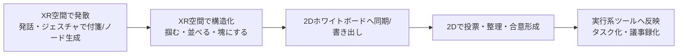

# AR/XRを活用したリモートチーム向けコラボレーション・ワークショップツールの現状

## エグゼクティブサマリ

2026年3月10日（日本時間）時点の市場は、「VR会議室（アバター＋空間オーディオ＋ホワイトボード）系」と「3Dモデルを“掴んで動かす”設計レビュー系」、そして「2Dホワイトボード（Miro等）をXRに橋渡しする連携系」に大別できる。
象徴的なのは、VR仕事場アプリであったHorizon Workroomsが2026年2月16日に提供終了（データ削除）となり、VR“オフィス”単体アプリの主戦場が縮小した点である。citeturn3search7turn3search3turn3search11 
一方で、entity["company","Microsoft","technology company"]はMesh関連の既存体験（Web/PC/Questアプリ等）を2025年12月1日に退役させ、「Teams内のイマーシブイベント」へ整理しており、XRは“会議”よりも“イベント／空間体験”として再定義されつつある。citeturn6search1turn6search0

「アイデアを空間上で身体的に操作する」体験を、ワークショップ（発散→構造化→評価→収束）の文脈で最も強く出すのは、（A）SpatialやGlueのように“付箋／ノート／描画”を空間オブジェクトとして扱える系、（B）Campfire 3Dのように“部品・モデルを掴んで外す／回す／スナップして戻す”など、操作語彙が物理行為に近い系、（C）Nodaのように“XR空間で発想・構造化→Miroへ同期”し、非XR参加者や後工程（チケット化等）へ繋げる橋渡し系である。citeturn12search1turn19search0turn17search3turn17search9turn9search7turn9search4

入力実装の現実解は、現時点では「ハンドトラッキング（ピンチ等）＋音声（speech-to-text）＋コントローラ（グリップ／トリガー）」の組み合わせが主流で、強い物理フィードバック（力覚）を標準装備するツールは少ない（コントローラのバイブが中心）。citeturn12search1turn18search2turn16search13turn19search0 ただし研究領域では、付箋をピンチで動かすだけでなく、非利き手の掌に“束ねる”、相互に“貼り合わせる”といった、より身体性の高い操作も提案されており、製品側の操作語彙が今後拡張される余地は大きい。citeturn11search9turn2search25

## 市場の整理と評価観点

XRワークショップツールを「身体的操作」という観点で比較する場合、単に“VRで会議できる”よりも、次の3層に分けて評価すると解像度が上がる。

第一に「アイデアの表現形式」：2Dキャンバス上の付箋（Miro等）か、3D空間内のオブジェクト（付箋・ノート・模型・部品）か。Miroは付箋の追加・移動・色分け・クラスタリングを2Dで強く支える一方、XRで空間操作をネイティブに提供するわけではない。citeturn18search7turn9search1

第二に「入力の身体性」：  
* 手の形（ピンチ等）で“掴む／離す”、腕の動きで“配置する”、音声で“生成する”  
* コントローラのトリガー／グリップで“把持する”、ジョイスティックで“移動する／テレポートする”  
製品の多くは、手入力とコントローラ入力を併用（あるいは片方を主）として成立している。例えばMeta Quest系の開発者ドキュメントでも、ハンドトラッキングを入力として有効化でき、Touchコントローラのハプティクス制御も別枠で扱われる（＝「触った感」は多くがコントローラ振動として実装される）という整理が見える。citeturn16search13

第三に「外部化（ワークショップ成果の持ち出し）」：XR内の付箋・構造が、PNG/画像・プロジェクト書き出し・2Dホワイトボード同期などで外部に出せるか。ここが弱いと、XR内で盛り上がっても、後工程（ドキュメント化、チケット化、意思決定ログ等）へ繋がりにくい。NodaはMiroの付箋と同期（Push/Pullや双方向同期）し、XR内の空間構造を2D側に流す経路を明示している。citeturn9search7turn9search4

また、ARグラス対応は「ネイティブアプリ」だけでなく「ブラウザ（WebXR）経由」「2D互換アプリ（例：iPadアプリをvisionOSで動かす）」も含めて実務上は重要になる。Apple Vision Proは視線・手・音声で操作する設計である。citeturn8search1 一方、visionOSのSafariにおけるWebXRは、visionOS 2.0時点で`immersive-vr`（WebVR）とHand Input等がデフォルト有効になったという技術コミュニティ報告があるが、`immersive-ar`（WebAR）側は動作しない旨も報告されており、ブラウザARは制約が残る。citeturn16search36

## 主要商用ツールの現状

### Spatial

SpatialのVRヘッドセット利用ガイドには、空間内で3D描画（Scribble）を行う際に「指のピンチ」または「コントローラのトリガー」で描けること、ノート（Notes）を作成して音声→テキスト化で入力できること、ノート上に直接描き込める（“white boarding in Spatial”）ことが明記されている。citeturn12search1 これは「アイデア＝空間オブジェクト（ノート）」として生成し、配置し、追記・編集できる構造であり、ワークショップの“発散→逐次整理”に相性が良い。

また、SpatialはWeb/VR/AR/モバイルへ公開できることを前提とした料金体系・提供形態を掲げ、SSO等のエンタープライズ要件も上位プランで扱う。citeturn13view0 実運用では“参加者のデバイス非対称”が常態になるため、Web/モバイルでの参加導線がある点は、ワークショップ導入の障壁を下げる。

Vision Pro関連では、App Store上にSpatial Companionが存在し、Vision Proユーザーの体験を遠隔操作・誘導（ユーザー操作を許可する／受動にする等）でき、3Dオブジェクト操作や描画の権限設計を含む説明がある。これは「共同作業」というより「ガイド付きデモ／ファシリテーション支援」に近いが、ワークショップの“運営者が場を制御する”用途には接続しうる。citeturn8search9

事例・背景としては、entity["organization","MIT News","massachusetts institute of technology news"]がSpatialを取り上げ、リモート環境で白板や付箋に相当する機能で共同作業を行い、ハイタッチ等の身体ジェスチャも交えて協働している様子や、entity["company","Mattel","toy company"]・entity["company","BNP Paribas","banking group"]・entity["company","Enel Group","energy company"]といった利用企業例を紹介している。citeturn12search5

image_group{"layout":"carousel","aspect_ratio":"16:9","query":["Spatial VR collaboration meeting avatar whiteboard notes","Campfire 3D collaboration CAD design review headset","Glue VR collaboration whiteboard sticky notes","VIVE Sync meeting sticky notes tool","Cisco Spatial Meetings Webex Apple Vision Pro"],"num_per_query":1}

### Horizon Workrooms

Horizon Workroomsは、2026年2月16日をもって提供終了し、以降アクセス不能となり、Workroomsに関連付いたデータが削除される（終了前のデータ書き出し導線も案内）と公式ヘルプで明記されている。citeturn3search7turn3search3 日本語メディアでも同内容が報じられている。citeturn3search11

重要なのは「（少なくとも単体アプリとしての）VRワークショップ室」が撤退しただけでなく、Workroomsが持っていた“物理空間を仮想ホワイトボード化する”方向性が、プラットフォーム戦略の変化で不連続になった点である。2022年時点の公式発表では、現実空間の空きスペースを仮想ホワイトボードにでき、そこへsticky notes（付箋）を貼れる機能が紹介されていた。citeturn12search13 しかし2026年時点では、Workrooms自体を継続利用してワークショップ機能を積み上げる、という選択肢は基本的に成立しない。

一方、Workrooms終了後もMeta Quest Remote Desktopアプリは残るとされており、XRを「空間UIでPC作業する」方向で代替する（＝ワークショップは2Dツール、表示や没入はXR）という運用は残り得る。citeturn3search7

### Campfire 3D

Campfire 3Dは「3Dのためのコラボレーション」を掲げ、PC/Mac/iPadおよびAR/VRヘッドセットで同一の3Dシーンを扱う設計で、モデルをコピー／ペースト／移動／回転／リサイズして説明できるとする。citeturn17search6turn17search2

身体的操作の解像度が高いのは、クイックスタートで「move/rotate/scale」「explode」「slice」「grab toolで部品を取り外してシーン内へ移動」など、“物体の扱い”に直結したツール語彙を明示し、VR側でも「任意の軸で掴んで回せる」「コントローラ側面のグリップボタンで把持する」等の操作がリリースノートで具体化されている点である。citeturn17search3turn17search24 iPad版でもGrab toolにより部品を動かし、スナップして元の位置に戻す挙動が更新履歴として書かれており、“組み合わせる／戻す”が体験に組み込まれている。citeturn17search9

対応デバイスは拡張が続いており、公式ブログではHTC VIVEやVarjo XRシリーズ対応を告知している。citeturn5search0 またサポートセンターではQuest 2/3/3S/Proをサポートし、他者がPC/Mac/iPadの場合は矩形、XRヘッドセットの場合は頭部アイコンで視線方向がわかる、といったクロスデバイス協働の可視化も説明されている。citeturn17search2

入出力については、40+のCAD/3D形式に対応し（主要CADのネイティブ形式を含むと明記）、さらにEnterpriseではプロジェクト全体をエクスポート／インポートできる（バックアップや移管用途）とサポートで説明される。citeturn17search1turn17search4

セキュリティは、SOC 2準拠や（顧客クラウドに機密データを保持する）ハイブリッドクラウド選択肢、AWS上でのホスティング等を掲げる。citeturn3search5turn3search1 共有のガバナンスとして、信頼済みドメインのみ共有可能にする機能も更新履歴として示されている。citeturn17search9 価格は公式に、Starter無料とEnterprise 1,500 USD/ユーザー/年（条件あり）を提示している。citeturn4search1

ARグラス側では「Apple Vision Pro向けのプレビュー申請ページ」があり、現時点で一般提供というよりは限定提供（プレビュー）段階に見える。citeturn8search10

### Miro（XR連携を含む）

Miroの中核は2Dのオンラインホワイトボードで、付箋の同時追加・移動・色分け・クラスタリング等を強みとして説明している。citeturn18search7 価格はFree〜Enterpriseの階層で公開され、エンタープライズでは追加のガード機能も打ち出している。citeturn3search2turn3search6 セキュリティ面ではSOC 2 Type II、データレジデンシー（EU/US/Australia等）、GDPR等を前面に出している。citeturn3search18turn3search14

XRとの関係は、現実的には「MiroそのものをXRネイティブにする」より、「XR空間での作業をMiroへ繋ぐ」か「XR内に2Dとして持ち込む」方向が強い。

Meta Quest向けには2021年に「2Dパネルアプリ」としてMiroアプリを提供したと公式ブログで説明している。citeturn9search1 ただし、少なくともユーザーコミュニティ上ではVision Pro向けネイティブ対応要望が継続している。citeturn8search0 visionOS上で「iPadアプリが動く」ことでMiroを使うという実務的な言及もあるが、これは第三者の経験談であり（公式仕様というより互換動作の範疇）、操作性・最適化は用途次第でばらつきが出る。citeturn8search4

MiroのXR連携で最も明確なのは、Nodaとの統合である。Miro Marketplace上で、Noda shapesとMiroのSticky Notesを同期でき、Push/Pullや双方向同期、さらに入力として「Hands, Eyes, Voice, Body」を謳っている。citeturn9search7 Noda側ドキュメントでも、XR空間で手や音声の自然入力を使って概念を動かし、洞察をMiroへ送る、というワークフローが説明されている。citeturn9search4

### その他主要な商用ツール群

Glueは、VR会議・共同作業プラットフォームとして、sticky notesやwhiteboards、3Dモデルの持ち込みを含むツール群を掲げる。citeturn7search9turn18search1 VR操作の具体はナレッジベースに詳細があり、テレポート移動（コントローラのジョイスティック押し込み）や、トリガー／グラブボタンで指や把持ジェスチャを制御し、オブジェクトを掴んで動かし、コンテキストメニューから削除・スケールなどを行うと説明される。citeturn19search0turn19search2 3Dモデルのインポート形式（FBX/OBJ/STL/GLTF等と推奨ポリゴン範囲）も明記されている。citeturn7search2 価格はFreeとProfessional（€50/ユーザー/月、年払い条件）等を公式が提示する。citeturn7search0 セキュリティではISO/IEC 27001取得が公表されている。citeturn6search3

VIVE SyncはVR会議アプリとして、対応ヘッドセット一覧（VIVE Focus系、Quest系等）を公式サポートが提示し、会議中にspeech-to-textで付箋を生成する手順（トリガー長押しで録音→付箋が空間に出現）まで操作仕様を明確にしている。citeturn15search2turn18search2 日本語の事例・紹介ページではISO 27701/27001取得を明言し、PCやモバイルからのログインも述べている。citeturn16search3

MeetinVRは、対応デバイス（Quest系／Pico系／Windows等）と、付箋をspeech-to-textまたはVRキーボード入力で作成し、ノートとして保存してデスクトップ側で参照できると説明する。citeturn5search3turn18search14

Arthurは、対応ヘッドセットとしてQuest系・Pico系・VIVE系と、PC/Web参加も可能である旨がサポートで更新されている。citeturn7search14 また、外部プロバイダ連携の説明でMiroを接続対象として挙げている（ただし、XR空間内でMiroがどの程度ネイティブに扱えるかは公開情報だけでは粒度が不足し、未指定扱いとする）。citeturn9search5

「大規模導入の現状」を示す動きとしては、Horizon Workrooms終了の一方で、Teams側のイマーシブイベントがPC/Mac/Questから参加できる一般提供（GA）になっている点が挙げられる。citeturn6search0 ただしこれは「場としての3D空間」と「アバター＋空間会話」を中心にし、付箋を掴んで投げるような“ワークショップ道具箱”というよりは、イベント体験寄りである（外部参加者は現状参加不可、など制約も明記）。citeturn6search23turn6search1

加えて、entity["company","Cisco","networking company"]のCisco Spatial Meetings（Webex＋Vision Pro）は、ステレオ撮影（デュアルレンズ）で“奥行きのある会議”を提供する方向で、空間協働を「3Dの対面感」に寄せている（付箋・白板というより、立体ビデオ会議の没入感が主軸）。citeturn15search12turn15search20turn15search16

## 比較表

不明点は「未指定」とした。表の内容は、特に断りがない限り各ツールの公式ドキュメント／サポート／公式ブログ記載を優先し、補助的にユーザーコミュニティや業界記事を用いた。citeturn12search1turn17search2turn19search0turn6search0turn9search7

### 対応・機能・身体的操作の比較

| ツール | 主用途 | 対応プラットフォーム | ARグラス/空間コンピューティング対応（機種・方式） | 身体的操作（触る・投げる・組み合わせる） | 実装（入力/フィードバック） | 共同編集・アバター・音声 | ホワイトボード/付箋 | 3D入出力 | 主な出典 |
|---|---|---|---|---|---|---|---|---|---|
| Spatial | VR/AR空間でのコラボ、ノート、3D描画 | 未指定（料金/提供形態上はWeb/VR/AR/モバイル想定） | Vision Pro向けCompanionアプリ（遠隔ガイド/操作権限） | ノートを空間に配置し編集、ノート上へ描画、3D描画（投げる/結合は未指定） | ピンチ or コントローラトリガーで3D描画、音声→テキストでノート作成 | アバター等は未指定（サポート文書はノート/描画中心） | Notes（付箋相当）＋描画 | 外部コンテンツ連携（Google Drive等）記載、3D入出力の形式詳細は未指定 | citeturn12search1turn8search9turn13view0turn12search5 |
| Horizon Workrooms | VR会議室（提供終了） | 2026-02-16で提供終了（Remote Desktopは残存） | 未指定 | 2022時点でMRホワイトボード＋付箋を紹介（現状は提供終了） | 未指定 | 未指定 | 付箋（紹介あり） | 未指定 | citeturn3search7turn3search3turn12search13turn3search11 |
| Campfire 3D | 3Dモデルの設計レビュー/説明/教育 | PC/Mac/iPad/XRヘッドセット（Quest等） | Vision Proはプレビュー申請（一般提供は未指定） | モデル移動/回転/拡縮、部品を“掴んで外す”、スナップして戻す（投げるは未指定） | Questではグリップで把持し任意軸回転、ツールに依存しない把持など更新 | クロスデバイス協働（PCは矩形/VRは頭部で視線共有） | 未指定（3D中心） | 40+ CAD/3D形式取込、Enterpriseはプロジェクトexport/import | citeturn17search6turn17search3turn17search24turn17search2turn17search1turn17search4turn8search10 |
| Miro | 2Dホワイトボード | PC/ブラウザ/モバイル中心（XRは連携・互換） | Vision Proは公式対応未指定（互換iPadアプリ運用の言及あり） | 2D上で付箋を追加/移動/色分け/クラスタ等（3D空間操作は未指定） | マウス/タッチ中心、XRは2Dパネルや外部連携 | 共同編集は前提（アバター/空間音声は未指定） | 付箋・テンプレ等 | 3D入出力は未指定（XR連携は別途） | citeturn18search7turn3search2turn8search0turn8search4 |
| Noda（Miro連携） | XR空間での発想・構造化→Miro同期 | Meta Quest等のMRヘッドセット（Miro Marketplace記載） | 未指定 | “概念を空間で動かす”ことを前提、Miro付箋と同期（投げる/結合は未指定） | 自然入力としてHands/Eyes/Voice/Bodyを明示 | 共有VR空間で協働を明示 | Miro付箋と同期 | 2D/3D空間の同期（Noda shapes↔Miro Sticky Notes） | citeturn9search7turn9search4 |
| Glue | VR会議＋道具箱（白板/付箋/3D） | Quest/Pico/VIVE Focus等 + PC/Mac（案内あり） | 未指定 | 掴む・動かす・スケール・削除など“物体操作”が明示（投げるは未指定） | コントローラのGrab/Triggerで手指・把持、テレポート移動、コンテキスト操作 | 未指定（別資料要） | Whiteboardあり、付箋はプラットフォーム説明に含まれる | FBX/OBJ/STL/GLTF等の3D取込 | citeturn7search1turn19search0turn19search2turn7search9turn7search2turn18search1 |
| VIVE Sync | VR会議 | PC VR/スタンドアロンVR（Quest等含む） | 未指定 | 付箋生成（音声→テキスト）、空間に出現（投げる/結合は未指定） | 付箋ツールでトリガー長押し録音→付箋生成 | アバター等は未指定（別資料要） | 付箋・描画など | 未指定 | citeturn15search2turn18search2turn15search15 |
| MeetinVR | VR会議＋共同作業 | Quest/Pico/Windows等 | 未指定 | 付箋を作成し保存、3D空間で利用（投げる/結合は未指定） | speech-to-textまたはVRキーボード | 未指定 | 付箋＋白板（レビューや説明で言及） | 未指定 | citeturn5search3turn18search14turn5search23 |
| Arthur | 企業向けVR協働（VR会議/空間） | Quest/Pico/VIVE等 + Web（Portal） | 一部でVision Pro言及あり（サポート記載範囲は要確認） | 未指定（操作語彙の公開情報不足） | 未指定 | 未指定 | 未指定 | 未指定 | citeturn7search14turn9search5turn7search34 |
| Teams イマーシブイベント | 3D空間イベント/参加体験 | Teamsアプリ（PC/Mac）＋Quest | Quest参加を明記（ARグラスは未指定） | “場”と空間会話中心（付箋/3D操作は未指定） | 未指定 | アバター参加を明記、外部参加者不可など制約 | 未指定 | 未指定 | citeturn6search0turn6search23turn6search1 |
| ShapesXR | XRプロトタイピング/共同設計 | Quest/Pico/Galaxy XR等 | 未指定 | 3Dプロトタイプを空間で操作（編集・インタラクション） | コントローラ操作（Play modeでスティック等） | 共同作業は製品説明に含まれるが詳細未指定 | Holonotes等の存在は目次に見える（詳細未指定） | 3Dモデルexport、Unity連携等 | citeturn16search24turn16search1turn15search0 |
| Frame（参考） | WebXR会議空間 | ブラウザ（WebXR） | 端末/ブラウザ依存（Vision Pro SafariのWebXR状況等に依存） | 未指定 | WebXR（QuestのOculus Browser等） | 未指定 | 未指定 | 未指定 | citeturn16search2turn16search36 |

### セキュリティ・価格・導入事例の比較

| ツール | セキュリティ/プライバシー要点 | 価格モデル（目安） | 導入・用途例 | 主な出典 |
|---|---|---|---|---|
| Spatial | 上位プランでSSO・外部API連携・SOC 2文書アクセス等を比較表に含める | Free $0、Personal $20/月、Education/EnterpriseはCustom | MIT Newsが企業利用例（Mattel等）を紹介 | citeturn13view0turn12search5 |
| Horizon Workrooms | 2026-02-16で終了、関連データ削除（事前にデータ書き出し案内） | 提供終了 | 提供終了（Metaの戦略転換として報道） | citeturn3search3turn3search7turn3search11 |
| Campfire 3D | SOC 2準拠、AWSホスティング、ハイブリッドクラウド選択肢、共有ドメイン制御 | Starter無料、Enterprise $1,500/ユーザー/年（条件） | 製品ライフサイクルの3D情報共有、Vision ProプレビューにCollins Aerospaceのコメント | citeturn3search5turn4search1turn17search9turn17search6turn8search10 |
| Miro | SOC 2 Type II、データレジデンシー等を明記 | Free〜Enterprise | 付箋・テンプレでワークショップ運用 | citeturn3search18turn3search2turn18search7 |
| Noda（Miro連携） | 未指定（Miro側の統制＋Noda側条件に依存） | 未指定（Marketplaceでサブスク要件の言及あり） | XR空間→Miro同期（2D/3Dブリッジ） | citeturn9search7turn9search4 |
| Glue | ISO/IEC 27001取得 | Free €0、Professional €50/ユーザー/月（年払い条件）等 | 企業利用例（Air France-KLM等）を公式が列挙 | citeturn6search3turn7search0turn7search36 |
| VIVE Sync | ISO 27701/27001取得を明記（日本語ページ） | 未指定 | 医療トレーニング等の事例を提示 | citeturn16search3turn16search7 |
| MeetinVR | 未指定（公開情報不足） | 未指定 | 白板や付箋、エクスポート等をレビューが言及 | citeturn5search23turn18search14 |
| Arthur | 未指定（公開情報不足） | 未指定 | Meta for Work記事でArthur利用例（VR協働）を言及 | citeturn7search34turn7search14 |
| Teams イマーシブイベント | Teamsの管理下、外部参加者不可等の制約を明記 | ライセンス条件は記事/ドキュメントに依存（ここでは未指定） | “Meshを置き換える”として公式が説明 | citeturn6search0turn6search23turn6search1 |
| ShapesXR | 未指定（公開情報不足） | 未指定 | XRデザインチーム向け（輸出/Unity連携など） | citeturn15search0turn16search24 |
| Frame（参考） | 未指定 | 未指定 | Questのブラウザで動くWebXR活用を強調 | citeturn16search2 |
| Cisco Spatial Meetings（参考） | Webexの枠組み（本表では詳細未指定） | 未指定 | Vision Proで“奥行きのある会議”（ステレオ撮影）を提供 | citeturn15search12turn15search20turn15search16 |

## 身体的操作体験の深掘り

### 身体的操作を成立させるUX要素

ワークショップで「身体的に操作できる」と感じられるためには、単なる3D表示では足りない。実装としては少なくとも、（a）“アイデアの生成”が速い、（b）“配置・再配置”が誤操作しにくい、（c）“グルーピング／関係の表現”ができる、（d）“外部化”できる、の4点が揃う必要がある。この整理は、Nodaが「XRの空間入力で発想→MiroへPushして社内の2D運用へ繋ぐ」と明示している点とも整合する。citeturn9search4turn9search7

また、テキスト入力が遅いと“発散”が詰まるため、音声→テキスト（speech-to-text）を付箋生成の一次手段として持つ設計が増えている。Spatialはノートを音声入力でき、VIVE Syncもトリガー操作で録音→付箋出現という手順を規定し、MeetinVRもspeech-to-textを明記する。citeturn12search1turn18search2turn18search14

### 具体的な操作フロー比較

Spatialでは、VR内メニューからNoteを作成し、音声→テキストで内容を入れ、空間に出たノートを編集（キーボード/マイク/描画）できる。さらにScribbleで、ピンチまたはコントローラトリガーで3D描画できるため、「付箋＋線（関係）＋囲い込み」を空間で直接表現しやすい。citeturn12search1 これは“ホワイトボードを空間に押し広げた”体験に近い。

Glueでは、VRコントローラが仮想手として表現され、トリガー／グラブで指・把持ジェスチャを制御する。テレポートで場所を移動しつつ、付箋や3Dオブジェクト（インポート物）を“掴んで動かす”ことが基本動作として明文化され、コンテキストメニューから削除・スケール等へアクセスする。citeturn19search0turn19search2 ワークショップの「クラスタリング」や「重要度でスケールを変える」「不要案を捨てる」に、操作語彙が直結しやすい。

Campfire 3Dは、ワークショップ形式というより「3Dで語る」ことに最適化されている。クイックスタートでmove/rotate/scaleに加え、explodeやslice、grab toolで部品を外して動かすなど、製品理解・合意形成のための“身体的操作”が中核機能として箇条書きされる。citeturn17search3 Quest側でもグリップボタンで把持し、ツール状態によらず回転できる等、実作業の詰まりを減らす改善が入っている。citeturn17search24 さらにiPad側でもGrab toolで部品をスナップして戻す挙動が更新されており、物理的な「外して、戻す」をUI語彙にしている点が、一般的な“3Dビューア”より一段強い。citeturn17search9

Miro単体は2D付箋が中心で、XRではパネル表示や互換アプリとして使う現実解が多い。citeturn9search1turn8search4 ただしNoda連携により、XR内で手・視線・音声・身体入力を使って空間上で概念を動かし、その結果をMiro付箋と同期できる。つまり「身体的操作の場＝Noda」「成果の集約＝Miro」という二層構成が取りやすい。citeturn9search7turn9search4

VIVE SyncやMeetinVRは、VR会議の道具箱として付箋を提供し、特にVIVE Syncは「トリガー長押しで録音→付箋が空間に出る」と操作仕様まで固定しているため、参加者への説明コストが低い。citeturn18search2turn18search14

### ワークショップ全体の“XR→2D→実行”の接続

XR内での身体的操作は、意思決定・実行へ繋がらないと“体験止まり”になりやすい。そこで、Noda↔Miroのように「XRで構造化→2Dへ同期→2D側で投票／優先順位→運用ツールへ」というパイプラインを設計すると、XRを“発散と構造化のエンジン”として位置づけやすい。citeturn9search7turn9search8

### UX評価の要点

「投げる」ジェスチャは直感的に見える一方で、協働環境では誤操作（飛びすぎ、他者の作業領域への侵入、取り戻しのコスト）が問題になりやすく、商用ツールは“投げる”より“掴む＋スナップ／制限付き移動”へ寄る傾向が強い。Campfireの“掴んでスナップして戻す”、Glueの“掴む→コンテキストでスケール/削除”は、この実務上の安定性を優先している設計と読める。citeturn17search9turn19search2

一方、研究プロトタイプでは、付箋をピンチで動かすだけでなく、掌にまとめて“束”として扱い、付箋同士を貼り合わせる、といった操作が設計されている。これは“投げる”よりも「両手の役割分担（バイマニュアル）」でスループットを上げる方向で、ワークショップの大量付箋処理に理にかなう。citeturn11search9turn2search25

## セキュリティ・プライバシーと価格モデル

調達観点では、XRワークショップツールは「SaaS（クラウド）で協働データを持つ」以上、通常の2Dホワイトボードと同程度かそれ以上に、アクセス制御・共有制御・監査証跡・データ所在地が問われる。MiroはSOC 2 Type IIやデータレジデンシー等を前面に出しており、既存の企業調達プロセスに乗りやすい。citeturn3search18turn3search14 CampfireはSOC 2やハイブリッドクラウド選択肢、共有ドメイン制御など、3Dデータ（設計資産）を扱う現場に合わせた統制を打ち出している。citeturn3search5turn17search9 GlueはISO/IEC 27001取得を公表しており、VR協働SaaSとしての基礎縦（ISMS）を示している。citeturn6search3 VIVE SyncもISO 27701/27001を明記し、プライバシー規格（27701）まで言及する点が特徴的である。citeturn16search3turn16search7

「終了・撤退リスク」も2026年の重要な論点になった。Horizon Workroomsは提供終了日以降アクセスできず、関連データが削除されると公式に明記されているため、PoC段階でも“エクスポート導線の有無”を初期から要件化する必要がある。citeturn3search3turn3search7 同様にMicrosoftも、Mesh関連体験を退役させてTeamsのイマーシブイベントへ置き換えると説明しており、XR機能の提供形態が短期で変動しうることが示唆される。citeturn6search1

価格モデルは、MiroのようにFree→Enterpriseの階層SaaS（ID数課金の色が強い）citeturn3search2、Spatialのように体験の同時参加者数・容量で拡張する設計citeturn13view0、Campfireのように3D/エンタープライズ前提で年額単価が明示されるモデルciteturn4search1、GlueのようにProfessional月額（年払い条件）を置くモデルciteturn7search0が混在する。ワークショップは“スポット利用”も多いため、ライセンスの柔軟性（ゲスト参加、閲覧のみ、録画・エクスポートの権限）も含めて見積もる必要がある（ただし各社の詳細条件はプラン・契約で変動し得るため、本レポートでは未指定扱いを残した）。citeturn17search4turn13view0turn7search0

## 研究プロトタイプと特許動向

学術的には、協働XRの体系化サーベイ（同期型AR/VR/MRリモートコラボ）や、Social VRにおける協働の長期評価の必要性を示すレビューがあり、「没入だけでは不十分で、協働の成果・信頼・継続利用まで含めて設計すべき」という論点が共有されている。citeturn11search25turn11search24

身体的操作に直結するプロトタイプとしては、付箋をピンチで動かし、非利き手の掌にまとめ、付箋同士を貼り合わせる、といった高スループット操作を含む協働空間の例が提示されている。citeturn11search9 さらに、Cross-Reality（デスクトップとAR/VRの混在）で“空間ハイパーメディア”として付箋等を扱う研究も出ており、2DとXRを跨いだ共同編集が研究の主題になっている。citeturn2search25

入力精度の課題に対しては、コントローラを“スタイラス化”して物理的に整列した仮想サーフェス上に書く、という枠組み（Off-The-Shelf Stylus）が提案されている。これは、VR内の自由空間描画が“書けるが読めない”問題に陥りやすいことへの工学的回答でもあり、ワークショップの可読性・記録性を改善する方向として重要である。citeturn7search24

触覚については、商用ツールの多くがコントローラ振動（ハプティクス）を基本にする一方、OpenXRレイヤで指ごとのハプティクスを提供するグローブ系（例：MANUSのOpenXR API Layer）も存在し、技術的には“指先で触る”体験を拡張できる。citeturn16search17 また、振動フィードバックがプレゼンス等を改善しうることは研究でも示されている。citeturn16search37 ただし現状のワークショップツールがこれら高機能ハプティクスを標準統合しているわけではなく、導入コスト・運用負荷とトレードオフになるため、2026年時点では“高度ハプティクス＝特定用途の追加装備”に留まる。

特許動向としては、XR環境で「電子ノート（notepad）からノートを剥がしてホワイトボードに貼る」という、まさに付箋メタファの操作を方法としてクレーム化したものが公開されている。citeturn11search3 また、ARでローカル／リモートの注釈を位置合わせして共有し、同一視野で操作する手法（遠隔AR注釈）も特許として提示される。citeturn11search1 空間オーディオについても、アバター位置に応じた左右音量調整（Web会議×仮想空間）などが特許化されており、“会議”の臨場感要素が知財化されていることが分かる。citeturn11search2